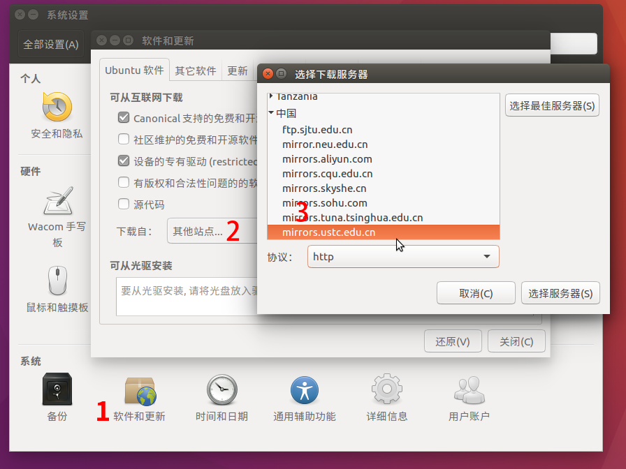

# Ubuntu

## 地址

<https://mirrors.ustc.edu.cn/ubuntu/>

## 说明

Ubuntu 软件源

## 收录架构

- AMD64 (x86_64)
- Intel x86 (i386)

其他架构请参考 [ubuntu-ports](ubuntu-ports.md)

## 收录版本

所有 Ubuntu 当前支持的版本，包括开发版，具体版本见 <https://wiki.ubuntu.com/Releases>。

对于 Ubuntu 不再支持的版本，请参考 [ubuntu-old-releases](ubuntu-old-releases.md)

## 使用说明

### 图形界面配置（新手推荐）

依次打开：系统设置，软件和更新。在 `下载自` 中选择 `其他站点`，然后在中国的条目下选择 `mirrors.ustc.edu.cn`。

下面是 Ubuntu 16.04 的操作示意图：



### 手动更改配置文件

!!! warning

    操作前请做好相应备份

一般情况下，将 `/etc/apt/sources.list` 或 `/etc/apt/sources.list.d/ubuntu.sources` 文件中 Ubuntu 默认的源地址 `http://archive.ubuntu.com/` 替换为 `http://mirrors.ustc.edu.cn/` 即可。

--8<-- "deb822.md"

可以使用如下命令：

- 传统格式（`/etc/apt/sources.list`）

    ```shell
    sudo sed -i 's@//.*archive.ubuntu.com@//mirrors.ustc.edu.cn@g' /etc/apt/sources.list
    ```

- DEB822 格式（`/etc/apt/sources.list.d/ubuntu.sources`）

    ```shell
    sudo sed -i 's@//.*archive.ubuntu.com@//mirrors.ustc.edu.cn@g' /etc/apt/sources.list.d/ubuntu.sources
    ```

!!! warning "安全更新源注意事项"

    因镜像站同步有延迟，可能会导致生产环境系统不能及时检查、安装上最新的安全更新，**不建议替换 security 源**。
    
    如果有官方源下载速度不理想等问题，想通过镜像站下载安全更新，可以将 security 源地址从 `http://security.ubuntu.com/` 替换为 `https://mirrors.ustc.edu.cn/`，即：
    
    - 传统格式

        ```shell
        sudo sed -i 's/security.ubuntu.com/mirrors.ustc.edu.cn/g' /etc/apt/sources.list
        ```
    
    - DEB822 格式

        ```shell
        sudo sed -i 's/security.ubuntu.com/mirrors.ustc.edu.cn/g' /etc/apt/sources.list.d/ubuntu.sources
        ```

!!! tip

    使用 HTTPS 可以有效避免国内运营商的缓存劫持。可以运行以下命令替换：

    - 传统格式

        ```shell
        sudo sed -i 's/http:/https:/g' /etc/apt/sources.list
        ```
    
    - DEB822 格式

        ```shell
        sudo sed -i 's/http:/https:/g' /etc/apt/sources.list.d/ubuntu.sources
        ```

当然也可以直接编辑 APT 源文件（需要使用 sudo）。以下是参考配置内容，**同时修改了软件源与安全更新源**：


=== "Ubuntu {{ release.version }}"

    === "`sources.list` 格式"

        ```debsources title="/etc/apt/sources.list"
        # 默认注释了源码仓库，如有需要可自行取消注释
        deb https://mirrors.ustc.edu.cn/ubuntu/ {{ release.codename }} main restricted universe multiverse
        # deb-src https://mirrors.ustc.edu.cn/ubuntu/ {{ release.codename }} main restricted universe multiverse

        deb https://mirrors.ustc.edu.cn/ubuntu/ {{ release.codename }}-security main restricted universe multiverse
        # deb-src https://mirrors.ustc.edu.cn/ubuntu/ {{ release.codename }}-security main restricted universe multiverse

        deb https://mirrors.ustc.edu.cn/ubuntu/ {{ release.codename }}-updates main restricted universe multiverse
        # deb-src https://mirrors.ustc.edu.cn/ubuntu/ {{ release.codename }}-updates main restricted universe multiverse

        deb https://mirrors.ustc.edu.cn/ubuntu/ {{ release.codename }}-backports main restricted universe multiverse
        # deb-src https://mirrors.ustc.edu.cn/ubuntu/ {{ release.codename }}-backports main restricted universe multiverse

        # 预发布软件源，不建议启用
        # deb https://mirrors.ustc.edu.cn/ubuntu/ {{ release.codename }}-proposed main restricted universe multiverse
        # deb-src https://mirrors.ustc.edu.cn/ubuntu/ {{ release.codename }}-proposed main restricted universe multiverse
        ```

    === "DEB822 格式"

        ```yaml title="/etc/apt/sources.list.d/ubuntu.sources"
        Types: deb
        URIs: https://mirrors.ustc.edu.cn/ubuntu
        Suites: {{ release.codename }} {{ release.codename }}-updates {{ release.codename }}-backports
        Components: main restricted universe multiverse
        Signed-By: /usr/share/keyrings/ubuntu-archive-keyring.gpg

        Types: deb
        URIs: https://mirrors.ustc.edu.cn/ubuntu
        Suites: {{ release.codename }}-security
        Components: main restricted universe multiverse
        Signed-By: /usr/share/keyrings/ubuntu-archive-keyring.gpg
        ```

        如果需要使用源码仓库，可以在 Types 中添加 `deb-src`。

        如果需要使用预发布软件源，可以在 Suites 中添加 `{{ release.codename }}-proposed`。


更改文件后请运行 `sudo apt-get update` 更新索引以生效。

另外，也可以使用 snullp 大叔开发的[配置生成器](https://mirrors.ustc.edu.cn/repogen)。

### 镜像下载

如果需要下载 Ubuntu 的 ISO 镜像以便安装，请参考 [ubuntu-releases](ubuntu-releases.md)。

## 相关链接

官方主页

:   <https://www.ubuntu.com/>

文档

:   <https://help.ubuntu.com/>

Wiki

:   <https://wiki.ubuntu.com/>

邮件列表

:   <https://community.ubuntu.com/contribute/support/mailinglists/>

提问

:   <https://askubuntu.com/>

论坛

:   <https://ubuntuforums.org/>

中文论坛

:   <https://forum.ubuntu.org.cn/>
